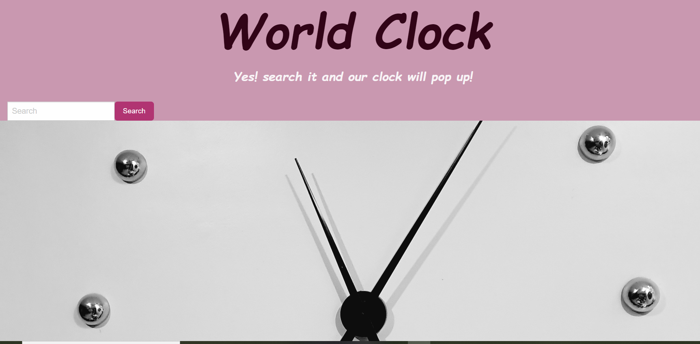

#  world-Clock

# Description
 
  
  Here is a link to our project:

   * Repo: 
   * Deploy: 

## Table of contents

* [Installation](#installation)
* [Usage](#usage)
* [Credits](#credits)
* [License](#license)
* [General info](#genral-info)
* [Technologies](#technologies)
* [Project status](#project-status)
* [Contact](#contact)

## Installation
* create a new repository (with active braches to work with)in GitHub.
* copy SSH key from GitHub
* * In your local computer make a directory using GitBash
* clone the active branch using "git clone <paste the ssh key here> -b <active branch name> 
* start to work on the project using any code editor , then add ,commit and push to the git repository.
* Now the project is locally saved in your computer and remotly saved in GitHUb.
* After all the work is done , set your gitHub pages to main and save it.
* Now the project is live on the web.

## Usage 
Screen shot 
* 

## Credits
Our project is based and inspired by;
 * 
 * 
 * 
 * The course module

 ## License
* [https://choosealicense.com/licenses/agpl-3.0/](https://choosealicense.com/licenses/agpl-3.0/)

## General info

## Technologies
On the top of  HTML, CSS and JavaScript, these web-page is created with:
* Foundation
* Jquery
* moments.js

## Project status
These project is still in developing mood, as it will be updated to a more detailed code with lots of illustrations.

## Contact
 * Created by: 
 
